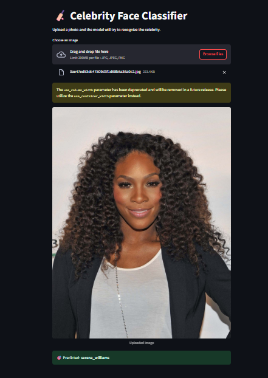

# 🧠 Sports Celebrity Image Recognition 

A deep learning-based image recognition system that identifies sports celebrities from uploaded photos. The app uses face detection and transfer learning to accurately classify images into one of five celebrity classes. Built with TensorFlow, OpenCV, and Streamlit for an interactive web experience.

---

## 📌 Project Description

This project is designed to classify images of popular sports celebrities using a **Convolutional Neural Network (CNN)** powered by **Transfer Learning**. 

The model focuses on faces detected in the images, ensuring accurate classification even with variations in backgrounds, lighting, and camera angles.

The application allows users to:
- Upload an image.
- Automatically detect and crop the face.
- Classify the image using a pre-trained deep learning model.

---

## 📂 Dataset Used

The dataset consists of  **manually collected images** of five well-known sports celebrities:

- Virat Kohli
- Lionel Messi
- Maria Sharapova
- Roger Federer
- Serena Williams

---
## ⚙️ Tech Stack / Skills Used

| Category                            | Tools & Technologies                                                         |
| ----------------------------------- | ---------------------------------------------------------------------------- |
| 🧠 Machine Learning & Deep Learning | TensorFlow / Keras, Transfer Learning (MobileNetV2), CNNs, Model Fine-tuning |
| 🖼️ Computer Vision                 | OpenCV, Face Detection (Haar Cascades, Eye Cascade)                           |
| 🖥️ App Development                 | Streamlit                                                                     |
| 💾 Others                           | Python, NumPy, Pandas                                                        |

## 📌 WebApp Screenshots

---

### 👨‍💻 Author
Darshan Dukhande

Aspiring Data Scientist | ML Enthusiast

📫 dukhandedarshan8@gmail.com

---

